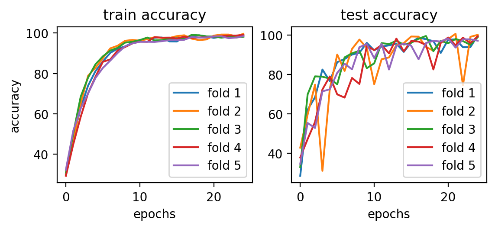
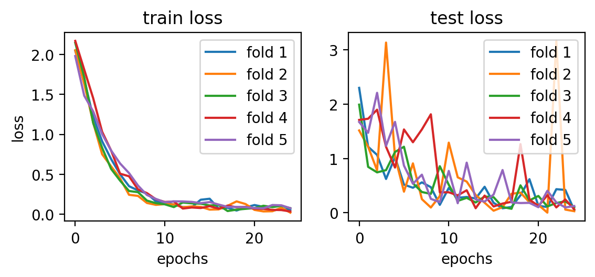
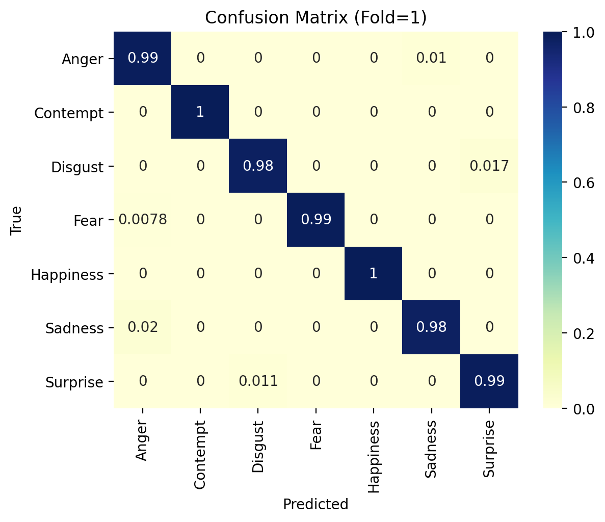

# DeXpression PyTorch
[](https://paperswithcode.com/sota/facial-expression-recognition-on-mmi?p=dexpression-deep-convolutional-neural-network)


A PyTorch implementation of DeXpression for facial expression recognition.

## Setup
Run the commands below to setup your local environment.

#### Install requirements
```bash
$ git clone git@github.com:rdgozum/dexpression-pytorch.git
$ cd dexpression-pytorch
$ pip install -r requirements.txt
```

#### Download the CK+ Dataset and Pretrained Weights
```bash
$ bash ./scripts/download_data.sh
$ bash ./scripts/download_ckpt.sh
```

## Run Project
Run the script below to start training your model. Once finished, the model checkpoints and performance plots will be saved in the results directory.
```bash
$ cd dexpression_pytorch
$ python main.py
```

## Results
The graphs shown below provide a performance summary of the model in assigning images from the CK+ dataset to face expression categories. In particular, we used accuracy and loss which are two common metrics when dealing with classification problems.

#### Accuracy and Loss
| Fold | Train Accuracy | Test Accuracy | Train Loss | Test Loss |
| :---: | :------------: | :-----------: | :--------: | :-------: |
| 1     | 98.94          | 99.74         | 0.056      | 0.049     |
| 2     | 99.64          | 100.00        | 0.017      | 0.030     |
| 3     | 98.19          | 98.95         | 0.073      | 0.103     |
| 4     | 99.06          | 99.32         | 0.031      | 0.067     |
| 5     | 98.47          | 97.11         | 0.072      | 0.125     |

<br />
<p align="left"></p>
<p align="left"></p>

#### Confusion Matrix
<br />
<p align="center"></p>

## Paper
### DeXpression: Deep Convolutional Neural Network for Expression Recognition
_Peter Burkert, Felix Trier, Muhammad Zeshan Afzal, Andreas Dengel, Marcus Liwicki_

#### Abstract
We propose a convolutional neural network (CNN) architecture for facial expression recognition. The proposed architecture is independent of any hand-crafted feature extraction and performs better than the earlier proposed convolutional neural network based approaches. We visualize the automatically extracted features which have been learned by the network in order to provide a better understanding. The standard datasets, i.e. Extended Cohn-Kanade (CKP) and MMI Facial Expression Databse are used for the quantitative evaluation. On the CKP set the current state of the art approach, using CNNs, achieves an accuracy of 99.2%. For the MMI dataset, currently the best accuracy for emotion recognition is 93.33%. The proposed architecture achieves 99.6% for CKP and 98.63% for MMI, therefore performing better than the state of the art using CNNs. Automatic facial expression recognition has a broad spectrum of applications such as human-computer interaction and safety systems. This is due to the fact that non-verbal cues are important forms of communication and play a pivotal role in interpersonal communication. The performance of the proposed architecture endorses the efficacy and reliable usage of the proposed work for real world applications.

[[Paper]](https://arxiv.org/abs/1509.05371)


## Credit
```
@article{Burkert2015DeXpressionDC,
  title={DeXpression: Deep Convolutional Neural Network for Expression Recognition},
  author={P. Burkert and F. Trier and M. Afzal and A. Dengel and Marcus Liwicki},
  journal={ArXiv},
  year={2015},
  volume={abs/1509.05371}
}
```
